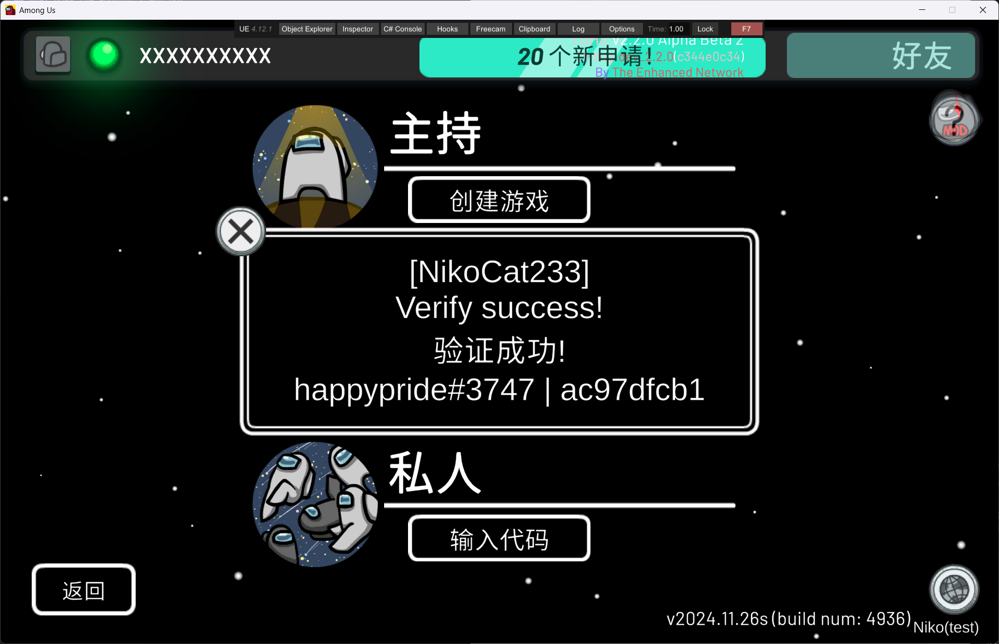
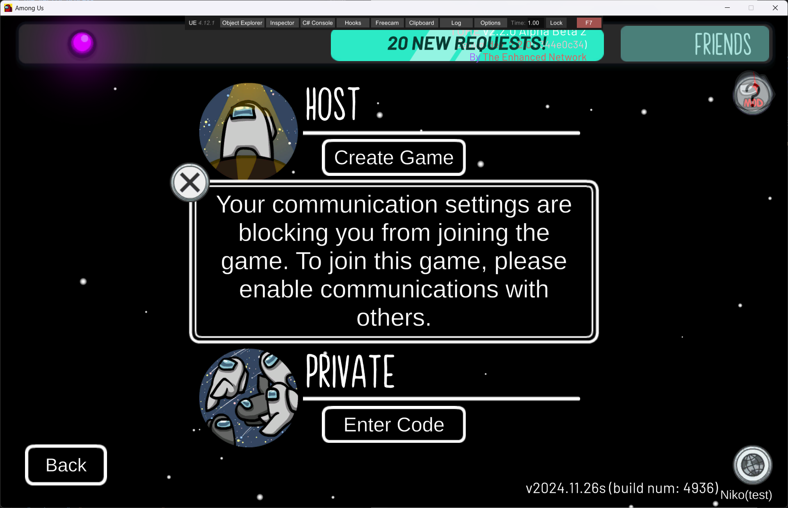
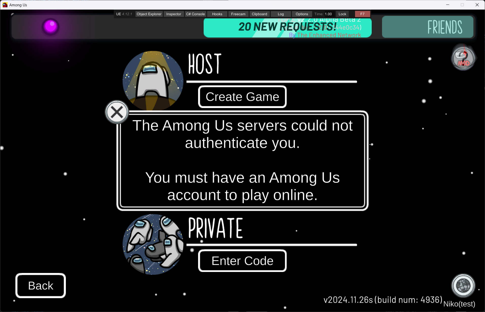

# NikoCat233's Impostor Server - au-verify endpoint api doc
## What does the endpint / api do?
Verifying players' friend codes is a crucial requirement for many Among Us gaming groups. 

This task often (unfortunately) has to be done manually. Manual verification is not only time-consuming and labor-intensive but also susceptible to deception by guest accounts and photoshopped images.

To address the security issues of verification, improve review efficiency, and promote automation of the review process, Niko has developed an automated API based on the existing account verification feature of the Niko private server. 

This API allows players to complete verification themselves by entering the server, replacing manual review, saving time, and preventing illegal deception.

## How to appeal for a api key?
This feature is currently in beta stage. You need to contact @NikoCat233 on Discord for more details.

## The verify process
1. The bot creates a verification request with an HTTP PUT request, providing the API key and returning the verification code (same as the game code).
2. The bot provides the game code to the player.
3. The player joins Niko(AS) with the game code, server respond server ip and port to user, and put the info from http part auth to verify request.
4. The player really joins the server from udp part. Udp part add more data to verify request and disconnect player with a message confirming that the verification is successful.
5. The bot queries the verification results with an HTTP GET request, providing the API key and the verification code.
6. After the verification process is finished, the bot can use an HTTP DELETE request, providing the API key and the verification code, to delete the verification request before it automatically expires.

## User Verify Example
Verify success will only be shown once. 

~~Guest account will see "You communication settings are blocking you from joining the game."~~

Guest account is **no longer blocked** after 2025.2.23. To check Guest account, you need to read TokenPlatform. "deviceid" in it is guest account. TokenPlatform is also shown to users that has verified.

NotAuthorized users will see "You need an Among Us account to play online."

In all other cases, "game not found" will be displayed.

### Verify Success

### Guest Account
Check TokenPlatform in Verify Response. Also present on the verisy message to players.

### NotAuthorized


## Note - Read carefully
~~Currently the api can only show whether a player is using a real account to join the server, or they did not join the server.~~

~~**Guest account is global prevented from the server** so the api can not detect it, and will not respond to guest account requests.~~

To check Guest account, you need to read **TokenPlatform**. "deviceid" in it is guest account. No other flags are provided for guest account.

You can only see **NotVerified, HttpPending, Verified or Expired** from the api.

The verify process is contained of two part: http auth and udp join game. If the player is unable to join the server but did input their game code and is received by the server's http auth part, they will get verify status set to **HttpPending** and **do show a friendcode and hashedPuid** in verify request. After they join the server from udp part, more data will be added to verify request and verify status is then changed to **Verified**.

Magic friendcode: kidcode#8888 for players that disabled friendcode feature with KWS parent portal. nocode#9999 for players who has not yet set up their friendcode.

**Guest account** will have friendcode other than magic friendcodes listed above only if they are **hacking**.

TokenPlatform in verify request is the platform got directly from InnerSloth api and is **100% accurate**. But there is no official or standard document of these values and we don't fully understand **which string matches what platform**. UdpPlatform is from udp join game part and is set by client itself. This can be **spoofed** with hack menu.

A verify code only takes the first account from the http part that joins the server with it. This means that if a player join the server with same verify code from multiple devices, or they share the code with others, once they put their code and is **handled by http part**, you can then only **get the first account** they try to sign in and their **alts will be rejected from the server and won't be logged**.

## API Endpoints
### Request URL
`https://au-verify.niko233.me/api/verify`
All the requests should be sent with json and will be answered with json.

### PUT
Used to create a verify request, respond with the verify code(also game/room code) created.
```json
{
    "apikey": "api_key_here"
}
```

#### Return
```json
{
    "VerifyStatus": "Created",
    "VerifyCode": "ABCDEF",
    "ExpiresAt": "2025-02-03T11:43:08Z"
}
```
The expiration time is displayed in UTC and is 10 minutes after the request is created. 

The verify code is the room code provided to the player.

### GET
Used to query the verify status of a verify request.
`?apikey=api_key_here&verifycode=ABCDEF`

#### Return
**Key not found**
```json
{
    "VerifyStatus": "NotFound",
    "Message": "VerifyCode not found"
}
```

**Not verified**
```json
{
    "VerifyStatus": "NotVerified",
    "ExpiresAt": "2025-02-03T11:43:08Z"
}
```

**HttpPending**
```json
{
    "VerifyStatus": "HttpPending",
    "ExpiresAt": "2025-02-03T11:43:08Z",
    "PlayerName": "Niko233",
    "FriendCode": "***#****",
    "Puid": "*********",
    "HashedPuid": "****",
    "HttpIp": "48.***.***.***",
    "TokenPlatform": "steam"
}
```

**Verified**
```json
{
    "VerifyStatus": "Verified",
    "ExpiresAt": "2025-02-03T11:43:08Z",
    "PlayerName": "Niko233",
    "FriendCode": "***#****",
    "Puid": "*********",
    "HashedPuid": "****",
    "HttpIp": "48.***.***.***",
    "UdpIp": "113.***.***.***",
    "TokenPlatform": "steam",
    "UdpPlatform": "StandaloneSteamPC"
}
```
The fields `"ExpiresAt": "2025-02-03T11:43:08Z"`, `"FriendCode": "***#****"`, `"Puid": "*********"`, `"HashedPuid": "****"`, `"TokenPlatform": "steam"` will always be provided.

**Expired**
```json
{
    "VerifyStatus": "Expired",
    "ExpiresAt": "2025-02-03T11:43:08Z"
}
```

### DELETE
Used to delete a verify request before it automatically expires. Suggest deleting instantly after you get all the necessary data.
```json
{
    "apikey": "api_key_here",
    "verifycode": "abcdef"
}
```

#### Return
**Key not found**
```json
{
    "VerifyStatus": "NotFound",
    "Message": "VerifyCode not found"
}
```

**Deleted success**
```json
{
    "VerifyStatus": "Deleted",
    "Message": "VerifyCode deleted"
}
```

### Other
wrong api key
```json
{
    "VerifyStatus": "NotAuthorized",
    "Message": "Unknown Api Token"
}
```
Internal server error
```json
{
    "VerifyStatus": "InternalServerError",
    "Message": "Detailed Message"
}
```
Server error will also be answered by dotnet core with following format

### Status Flags
```codes
    public enum VerifyStatus
    {
        Created,
        NotVerified,
        Verified,
        Expired,
        BannedByServer, // Not used
        BannedByEAC, // Not used
        NotFound,
        NotAuthorized,
        InternalServerError,
        Deleted,
        HttpPending
    }
```
BannedByServer(Banned by Niko), BannedByEAC(The Enhanced Network) is not added currently.

To check Guest account, you need to read TokenPlatform. "deviceid" in it is guest account.

```codes
    public sealed class VerifyRequest
    {
        [JsonPropertyName("ApiKey")]
        public required string ApiKey { get; init; }

        [JsonPropertyName("VerifyCode")]
        public string? VerifyCode { get; init; }
    }
```
```codes
    public sealed class VerifyResponse
    {
        [JsonPropertyName("VerifyStatus")]
        public required VerifyStatus VerifyStatus { get; init; }

        [JsonPropertyName("Message")]
        [JsonIgnore(Condition = JsonIgnoreCondition.WhenWritingNull)]
        public string? Message { get; init; }

        [JsonPropertyName("VerifyCode")]
        [JsonIgnore(Condition = JsonIgnoreCondition.WhenWritingNull)]
        public string? VerifyCode { get; init; }

        [JsonPropertyName("ExpiresAt")]
        [JsonIgnore(Condition = JsonIgnoreCondition.WhenWritingNull)]
        public string? ExpiresAt { get; init; }

        [JsonPropertyName("PlayerName")]
        [JsonIgnore(Condition = JsonIgnoreCondition.WhenWritingNull)]
        public string? PlayerName { get; init; }

        [JsonPropertyName("FriendCode")]
        [JsonIgnore(Condition = JsonIgnoreCondition.WhenWritingNull)]
        public string? FriendCode { get; init; }

        [JsonPropertyName("Puid")]
        [JsonIgnore(Condition = JsonIgnoreCondition.WhenWritingNull)]
        public string? Puid { get; init; }

        [JsonPropertyName("HashedPuid")]
        [JsonIgnore(Condition = JsonIgnoreCondition.WhenWritingNull)]
        public string? HashedPuid { get; init; }

        [JsonPropertyName("HttpIp")]
        [JsonIgnore(Condition = JsonIgnoreCondition.WhenWritingNull)]
        public string? HttpIp { get; init; }

        [JsonPropertyName("UdpIp")]
        [JsonIgnore(Condition = JsonIgnoreCondition.WhenWritingNull)]
        public string? UdpIp { get; init; }

        [JsonPropertyName("TokenPlatform")]
        [JsonIgnore(Condition = JsonIgnoreCondition.WhenWritingNull)]
        public string? TokenPlatform { get; init; }

        [JsonPropertyName("UdpPlatform")]
        [JsonIgnore(Condition = JsonIgnoreCondition.WhenWritingNull)]
        public string? UdpPlatform { get; init; }
    }
```
VerifyRequest and VerifyResponse simply shows how the server will serialize and deserialize json from http requests.

```codes
    public enum Platforms
    {
        Unknown,
        StandaloneEpicPC,
        StandaloneSteamPC,
        StandaloneMac,
        StandaloneWin10,
        StandaloneItch,
        IPhone,
        Android,
        Switch,
        Xbox,
        Playstation,
    }
```
This is the Platform officially provided by InnerSloth in game codes. We acquire it from udp join game part and client can spoof it with hack menu.

```codes
    List of part of the platform strings from http part
    {
        apple
        google
        epicgames
        steam
        itchio
        deviceid //Guest account, you need to check at your side. We no longer provide other flags for guest account except this one.
        xbl // Microsoft store version, not sure whether xbox console is using this string
        ## this list is incomplete, Niko never see console players' token.
    }
```
These platform strings is directly read from InnerSloth's http api. It is 100% accurate, showing the account type of the user and can not be spoofed. But we don't completely know how it matches Platforms flag provided in game codes and this list is also missing some of the strings.

To check Guest account, you need to read TokenPlatform. "deviceid" in it is guest account.