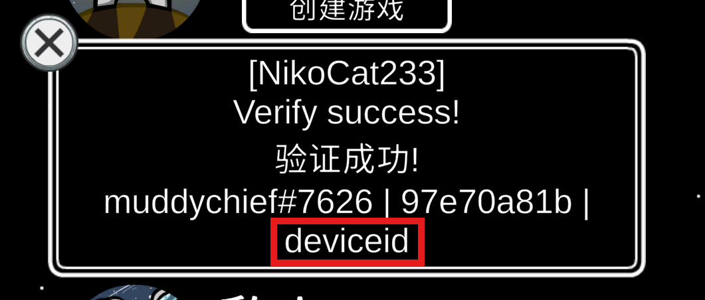

# NikoCat233's Impostor Server - au-verify endpoint api doc
## What does the endpint / api do?
Verifying players' friend codes is a crucial requirement for many Among Us gaming groups. 

This task often (unfortunately) has to be done manually. Manual verification is not only time-consuming and labor-intensive but also susceptible to deception by guest accounts and photoshopped images.

To address the security issues of verification, improve review efficiency, and promote automation of the review process, Niko has developed an automated API based on the existing account verification feature of the Niko private server. 

This API allows players to complete verification themselves by entering the server, replacing manual review, saving time, and preventing illegal deception.

## How to appeal for a api key?
This feature is currently in beta stage. You need to contact @NikoCat233 on Discord for more details.

## The verify process
1. The bot creates a verification request with an HTTP PUT request, providing the API key and returning the verification code (same as the game code).
2. The bot provides the game code to the player.
3. The player joins Niko(AS) with the game code and receives a message confirming that the verification is successful.
4. The bot queries the verification results with an HTTP GET request, providing the API key and the verification code.
5. After the verification process is finished, the bot can use an HTTP DELETE request, providing the API key and the verification code, to delete the verification request before it automatically expires.

## User Verify Example
Verify success will only be shown once. 
Guest account will see "You communication settings are blocking you from joining the game."
NotAuthorized users will see "You need an Among Us account to play online."
In all other cases, "game not found" will be displayed.
### Verify Success

### Guest Account

### NotAuthorized


## Note
Currently the api can only show whether a player is using a real account to join the server, or they did not join the server.
Guest account is global prevented from the server so the api can not detect it, and will not respond to guest account requests.
You can only see NotVerified or Verified from the api.
The player needs to join the server with both http requests and udp requests. If the player is unable to join the server, they wont be verified.

## API Endpoints
### Request URL
`https://au-verify.niko233.me/api/verify`
All the requests should be sent with json and will be answered with json.

### PUT
```json
{
    "apikey": "api_key_here"
}
```

#### Return
```json
{
    "VerifyStatus": "Created",
    "VerifyCode": "ABCDEF",
    "ExpiresAt": "2025-02-03T11:43:08Z"
}
```
The expiration time is displayed in UTC and is 10 minutes after the request is created. The verify code is the room code provided to the player.

### GET
`?apikey=api_key_here&verifycode=ABCDEF`

#### Return
**Key not found**
```json
{
    "VerifyStatus": "NotFound",
    "Message": "VerifyCode not found"
}
```

**Not verified**
```json
{
    "VerifyStatus": "NotVerified",
    "ExpiresAt": "2025-02-03T11:43:08Z"
}
```

**Verified**
```json
{
    "VerifyStatus": "Verified",
    "ExpiresAt": "2025-02-03T11:43:08Z",
    "PlayerName": "Niko233",
    "FriendCode": "***#****",
    "Puid": "*********",
    "HashedPuid": "****",
    "HttpIp": "48.***.***.***",
    "UdpIp": "113.***.***.***"
}
```
The fields `"ExpiresAt": "2025-02-03T11:43:08Z"`, `"FriendCode": "***#****"`, `"Puid": "*********"`, `"HashedPuid": "****"` will always be provided.

**Expired**
```json
{
    "VerifyStatus": "Expired",
    "ExpiresAt": "2025-02-03T11:43:08Z"
}
```

### DELETE
```json
{
    "apikey": "api_key_here",
    "verifycode": "abcdef"
}
```

#### Return
**Key not found**
```json
{
    "VerifyStatus": "NotFound",
    "Message": "VerifyCode not found"
}
```

**Deleted success**
```json
{
    "VerifyStatus": "Deleted",
    "Message": "VerifyCode deleted"
}
```

### Other
wrong api key
```json
{
    "VerifyStatus": "NotAuthorized",
    "Message": "Unknown Api Token"
}
```
Internal server error
```json
{
    "VerifyStatus": "InternalServerError",
    "Message": "Detailed Message"
}
```
Server error will also be answered by dotnet core with following format

### Status Flags
```codes
    public enum VerifyStatus
    {
        Created,
        NotVerified,
        Verified,
        Expired,
        GuestAccount, // Not used
        BannedByServer, // Not used
        BannedByEAC, // Not used
        NotFound,
        NotAuthorized,
        InternalServerError,
        Deleted,
    }
```
GuestAccount, BannedByServer(Banned by Niko), BannedByEAC(The Enhanced Network) is not added currently.

```codes
    public sealed class VerifyRequest
    {
        [JsonPropertyName("ApiKey")]
        public required string ApiKey { get; init; }

        [JsonPropertyName("VerifyCode")]
        public string? VerifyCode { get; init; }
    }
```
```codes
    public sealed class VerifyResponse
    {
        [JsonPropertyName("VerifyStatus")]
        public required VerifyStatus VerifyStatus { get; init; }

        [JsonPropertyName("Message")]
        [JsonIgnore(Condition = JsonIgnoreCondition.WhenWritingNull)]
        public string? Message { get; init; }

        [JsonPropertyName("VerifyCode")]
        [JsonIgnore(Condition = JsonIgnoreCondition.WhenWritingNull)]
        public string? VerifyCode { get; init; }

        [JsonPropertyName("ExpiresAt")]
        [JsonIgnore(Condition = JsonIgnoreCondition.WhenWritingNull)]
        public string? ExpiresAt { get; init; }

        [JsonPropertyName("PlayerName")]
        [JsonIgnore(Condition = JsonIgnoreCondition.WhenWritingNull)]
        public string? PlayerName { get; init; }

        [JsonPropertyName("FriendCode")]
        [JsonIgnore(Condition = JsonIgnoreCondition.WhenWritingNull)]
        public string? FriendCode { get; init; }

        [JsonPropertyName("Puid")]
        [JsonIgnore(Condition = JsonIgnoreCondition.WhenWritingNull)]
        public string? Puid { get; init; }

        [JsonPropertyName("HashedPuid")]
        [JsonIgnore(Condition = JsonIgnoreCondition.WhenWritingNull)]
        public string? HashedPuid { get; init; }

        [JsonPropertyName("HttpIp")]
        [JsonIgnore(Condition = JsonIgnoreCondition.WhenWritingNull)]
        public string? HttpIp { get; init; }

        [JsonPropertyName("UdpIp")]
        [JsonIgnore(Condition = JsonIgnoreCondition.WhenWritingNull)]
        public string? UdpIp { get; init; }
    }
```
VerifyRequest and VerifyResponse simply shows how the server will serialize and deserialize json from http requests.